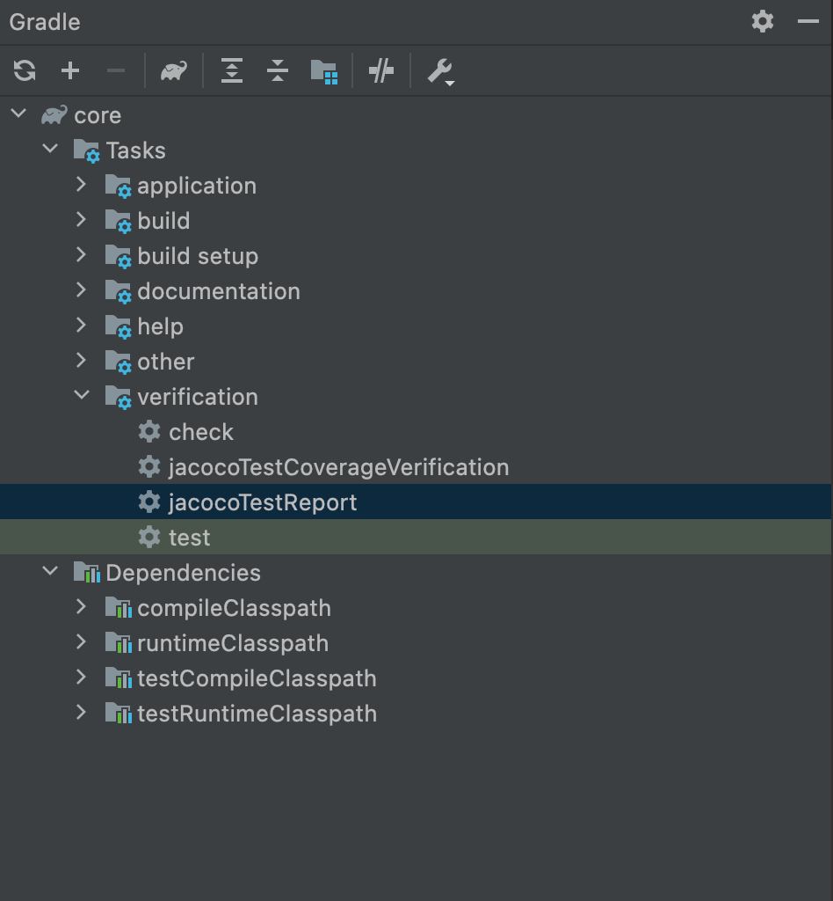
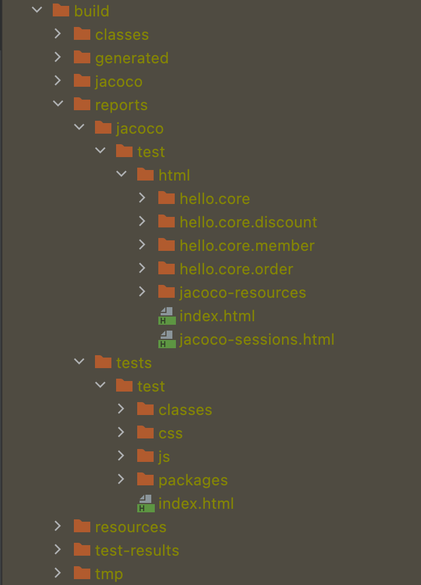

# Test Coverage

## Test Coverage란?

### 정적 분석 도구

코드 리뷰 등을 통해 동료 개발자들이 직접 검토하는 경우도 있지만 정형화된 패턴에 대해서는 소스 코드를 분석해주는 도구를 이용할 수 있는데 이러한 것을 코드 저적 분석이라고 한다.

### Code Coverage

-   소프트웨어의 테스트 케이스가 얼마나 충족되었는지를 나타내는 지표 중 하나.
-   테스트를 진행하였을 때 `코드 자체가 얼마나 실행되었느냐`의 판단과 수치로 확인 가능
-   보통은 `LineCoverage` 많이 사용.

<br />

## Jacoco

1. `build.gradle`에 `jacoco` 플러그인 추가

    build.gradle

    ```java
    plugins {
        id 'org.springframework.boot' version '2.6.2'
        id 'io.spring.dependency-management' version '1.0.11.RELEASE'
        id 'java'
        id 'jacoco'
    }
    ```

2. gradle 폴더에서 test 클릭
   

3. build 폴더 안에 reports 생성
   

4. `jacoco`와 `tests` 안의 index.html 을 통해 확인

<br />

## Reference

-   [[우아한 형제들]Gradle 프로젝트에 JaCoCo 설정하기](https://techblog.woowahan.com/2661/)
